# ArkLator

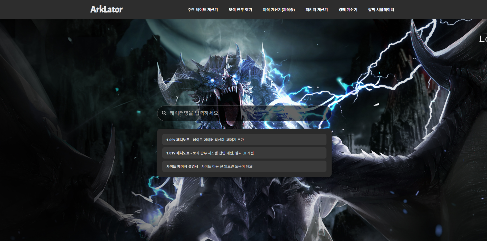
**ArkLator**는 **React**와 **TypeScript**로 구축된 웹 애플리케이션입니다.  
로스트아크 유저를 위한 다양한 유틸리티 기능을 제공하며, 주간 레이드 골드 계산기, 보석 매칭 도구, 팔찌 옵션 시뮬레이터 등을 포함하고 있습니다.  
경량화된 **Node.js/Express** 백엔드는 공식 게임 API와 Supabase 업데이트를 처리합니다.

## 주요 기능

- #### 주간 레이드 계산기

  여러 캐릭터를 탭 형식으로 관리하며, 골드 보상 및 재료 수익을 계산합니다.  
  상태는 `localStorage`에 저장되며, React Context 기반으로 전역 관리됩니다.

  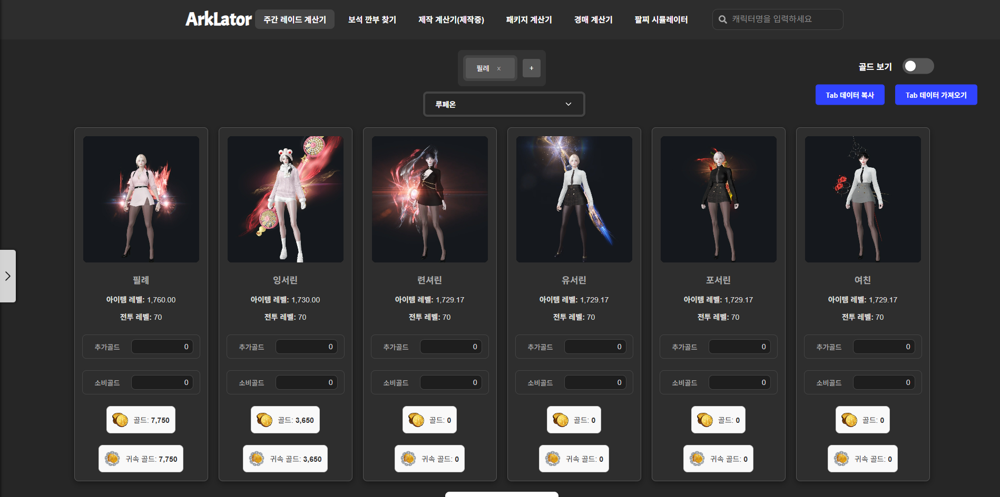
  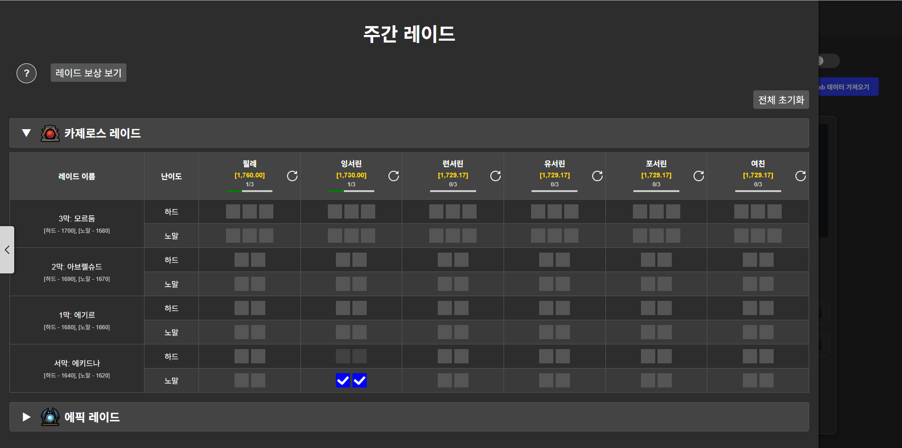
  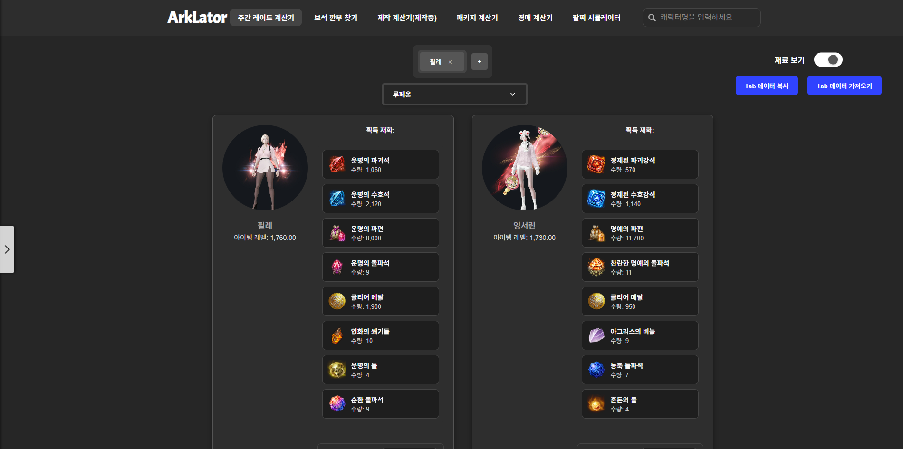

- #### 보석 친구 매칭

  각 캐릭터의 보석 정보를 비교하여 최적의 교환 상대를 자동으로 매칭합니다.  
  Supabase 실시간 감지를 통해 **서버 및 직업 기준**에 따라 자동 매칭되며,  
  매칭 상태 (`idle`, `queued`, `waiting`, `completed`)에 따라 UI가 실시간으로 변경됩니다.

  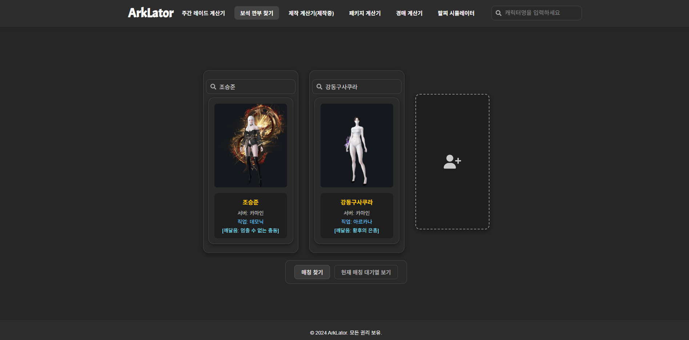
  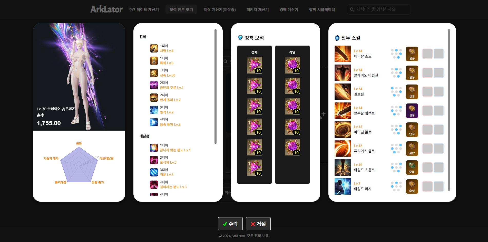
  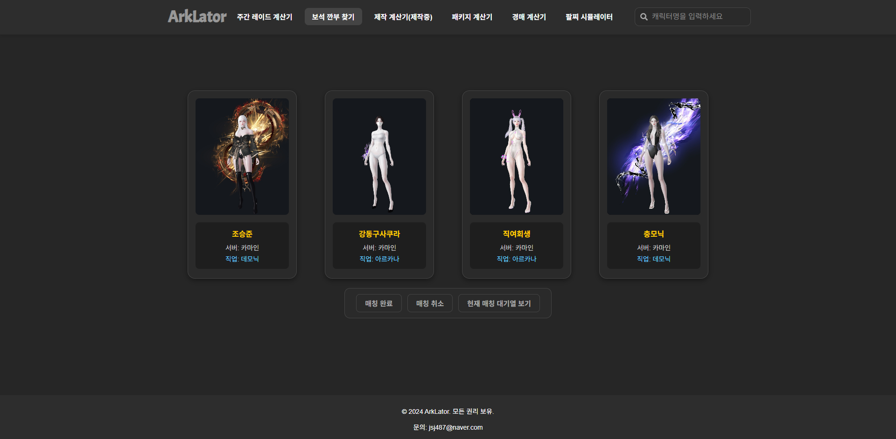

- #### 팔찌 시뮬레이터

  확률 기반 알고리즘(`GachaGenerator.ts`)으로 팔찌 옵션을 생성합니다.  
  유저가 시뮬레이션한 결과는 DB에 저장되며, 누적 로그를 기반으로 실제 등장 확률과 공식 확률과의 유사도를 시뮬레이션 통계로 시각화하여 제공합니다.

  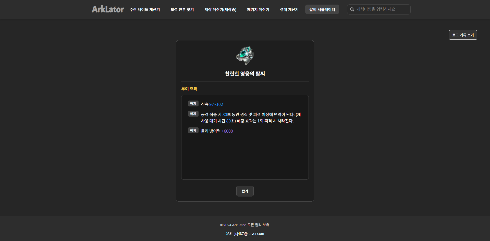
  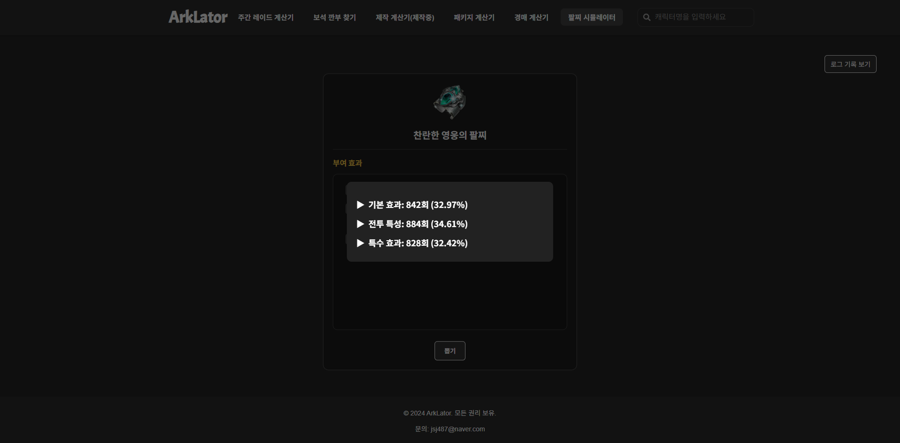

- #### 패키지 계산기

  Node 서버를 통해 실시간 경매장 시세를 가져와, 유료 패키지의 구성품 대비 효율을 분석합니다.

  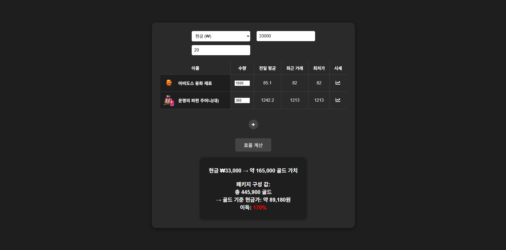

- #### 경매 계산기

  레이드에서 아이템의 입찰가에 따라, 모든 파티원에게 공평하게 분배될 입찰 기준가를 계산합니다.

  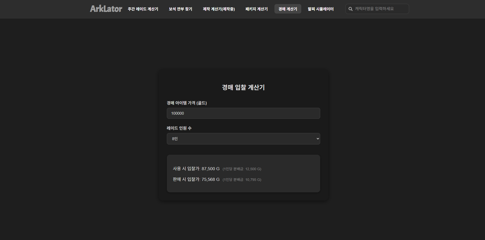

- #### 제작 계산기

  경매장에서 판매되는 재료 시세를 기준으로, 해당 재료를 직접 제작해서 파는 것이 이득인지 분석합니다.

  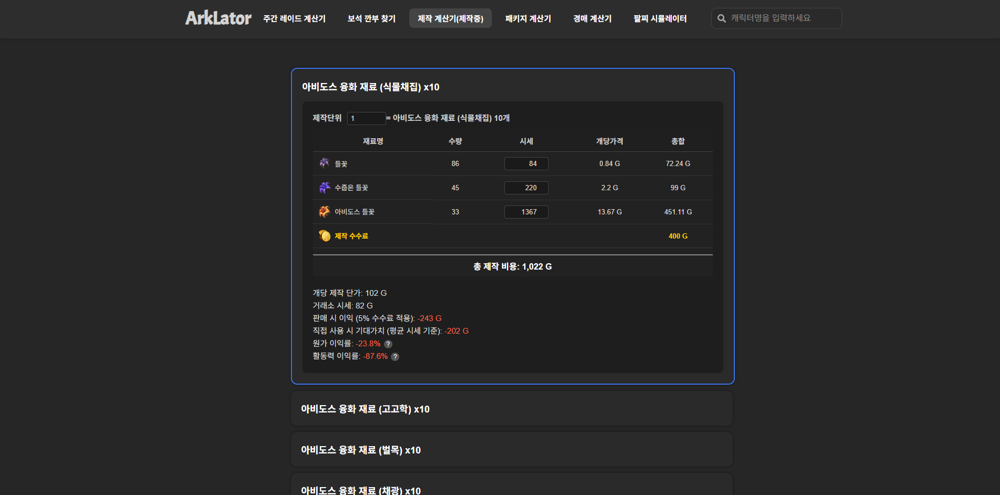

## 기술 스택

- **Frontend**: React, TypeScript, Styled-Components
- **Backend / DB**: Node.js (Express), Supabase
- **Tools**: GitHub, Postman, Figma

## 기술 설명

- 확률 기반 팔찌 옵션 생성기 구현: `src/utils/GachaGenerator.ts`
- 글로벌 상태 관리: 커스텀 React Context (`LayoutProvider`, `GoldCalcContext`)
- 인터랙티브 UI 컴포넌트 구현: 슬라이딩 메뉴, 아코디언 등
- Supabase의 실시간 감지 기능을 활용한 캐릭터 자동 매칭 로직
- 테마 기반 컴포넌트 스타일링

---

이 프로젝트는 실제 게임 유저의 니즈를 바탕으로 기획·구현되었으며,  
**React 기반의 상태 관리**, **API 통합**, **실시간 데이터 처리**, **UI 최적화** 등  
프론트엔드 실무 역량을 종합적으로 보여주는 예제입니다.
